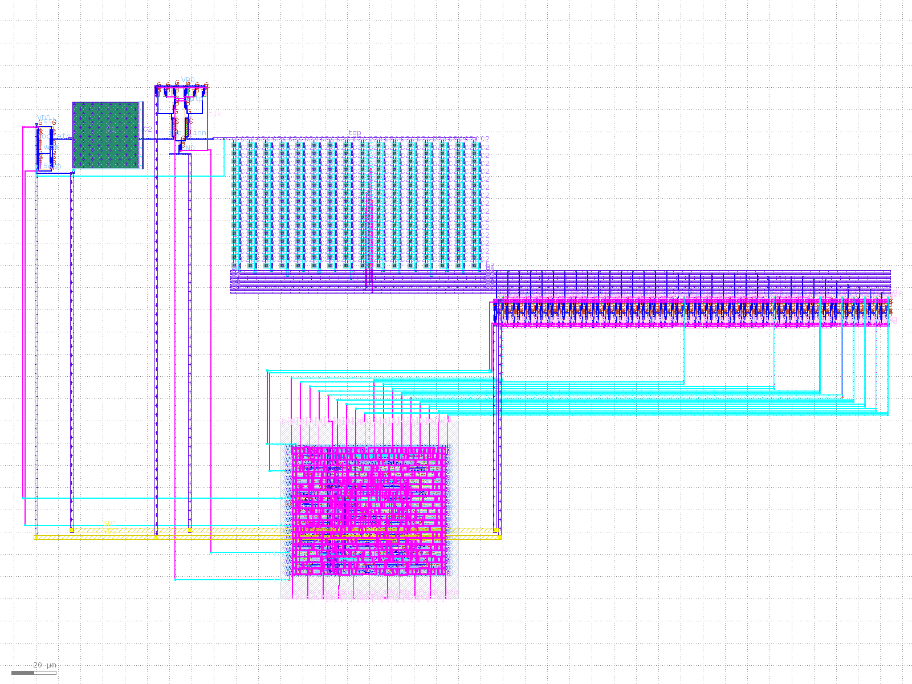
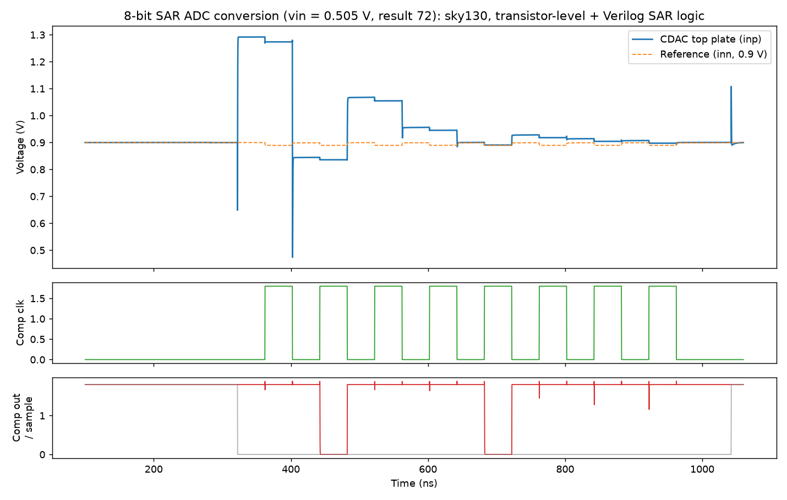
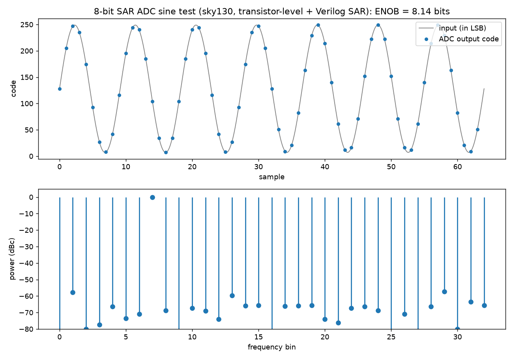

# 8-bit SAR ADC in SkyWater 130 nm (fully open-source flow)

A complete 8-bit successive-approximation (SAR) ADC, designed from transistor level to a DRC- and LVS-clean
full-chip layout, using only open-source tools on the SkyWater sky130 PDK.

**Status:** full chip assembled. Full-chip DRC: 0 errors. Full-chip LVS (analog + digital): circuits match.

## Architecture
| Block | Design |
|---|---|
| Capacitor DAC | 8-bit binary-weighted, 256 unit MIM caps (2x2 um, ~2 pF total), bottom-plate sampling, common-centroid layout |
| Switches | 35 copies of one unit switch cell (vin / vref / GND), sized in proportion to each bit's capacitance |
| Comparator | StrongARM latch, 11 transistors, mirror-symmetric layout |
| Analog front end | Top-plate sampling switch + matched dummy switch and capacitor on the comparator's other input (kickback cancellation) |
| SAR logic | Verilog FSM, synthesized and placed-and-routed with LibreLane (sky130_fd_sc_hd) |

Conversion: 23 clock cycles, 1.09 MS/s at a 25 MHz clock, 1.8 V supply, 0-1.8 V input range.

## Results
| Block | Key results |
|---|---|
| Comparator | Resolves 1 mV in all 15 corners (ss/tt/ff/sf/fs, -40 to 125 C). Offset sigma 2.9 mV (30-run Monte Carlo), down from 11.8 mV by resizing the input pair using Pelgrom's law. Delay 0.25-0.53 ns, 15.5 uW at 100 MHz |
| CDAC | Exact binary weights (7.03 mV/LSB). Mismatch Monte Carlo (30 runs): average worst DNL 0.25 LSB, max 0.62 LSB, no missing codes. Switch settling ~1 ns, step error < 0.25 LSB |
| SAR logic | 2000 random conversions, 0 errors. Setup slack +27.4 ns, hold +0.12 ns at 25 MHz. DRC / LVS / antenna: 0 / 0 / 0 |
| Full ADC (simulation) | Mixed-signal ngspice + Verilator: transistor-level analog with the real Verilog SAR logic. Comparator kickback found and fixed (offset +2 LSB to <= 1 LSB). 16-point sweep: average error +0.5 LSB |
| Sine test (ENOB) | 64-point coherent sine (7 cycles, 94% full scale), typical corner, noise-free: SINAD 50.7 dB, ENOB 8.1 bits, matching an ideal 8-bit quantizer. All codes within 1 LSB |
| Full chip | Magic DRC 0 errors. Netgen LVS: circuits match uniquely |

## Layouts
| Comparator | CDAC array | SAR logic |
|---|---|---|
|  |  |  |

## Repository structure
| Folder | Contents |
|---|---|
| `inverter/` | First block used to learn the flow: schematic, simulation, layout, LVS, post-layout extraction |
| `comparator/` | Netlist, testbenches (corners, Monte Carlo), layout scripts, layout, LVS report |
| `cdac/` | CDAC + switch netlists, testbenches (bit weights, mismatch, settling), array and switch layout scripts, LVS reports |
| `sar_logic/` | Verilog, testbench, LibreLane config and pin order, final GDS / LEF / DEF / gate-level netlist |
| `adc/` | Full-ADC mixed-signal simulation (testbenches, sweep, waveform plot) |
| `top/` | Analog front end, full-chip placement and routing scripts, final `adc_top.gds`, full-chip LVS |
| `images/` | Layout and waveform pictures |

## Tools
xschem, ngspice, Magic, netgen, KLayout, Icarus Verilog, Verilator, LibreLane (Yosys + OpenROAD), all run
from the IIC-OSIC-TOOLS container on a Raspberry Pi 5.

## Notes and next steps
- Simulations are at the typical corner unless stated. Full-ADC corner runs and a noise-enabled ENOB measurement are planned.
- The dummy capacitor is 30x30 um (the generator's maximum), about 88% of the CDAC area. Close enough for kickback balancing.

## Author
Tharun Kiruthik S.B, MSc Microelectronics Systems and Devices, Newcastle University
