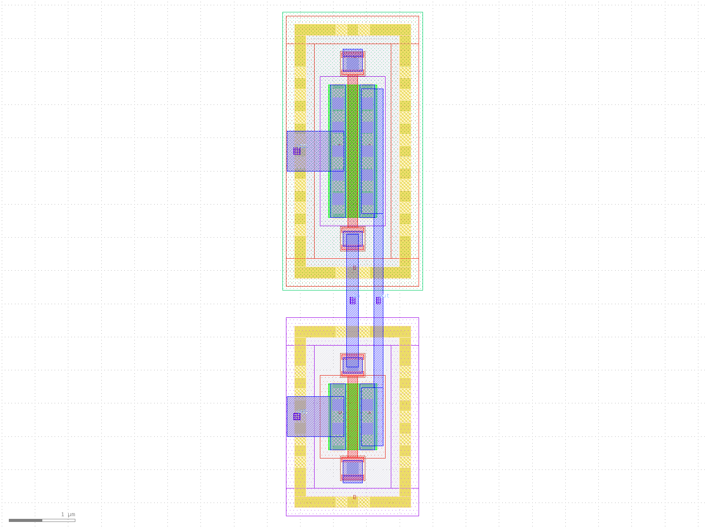
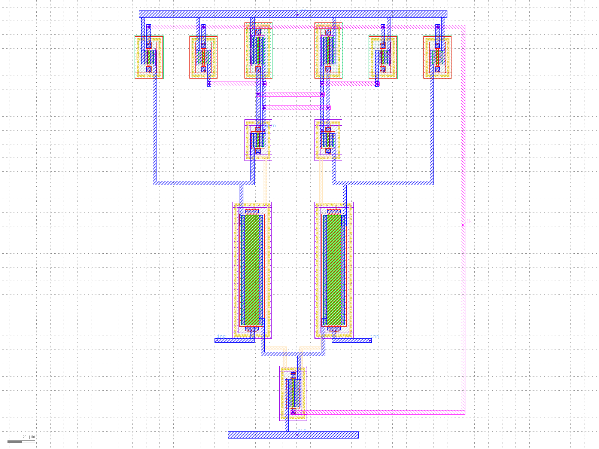
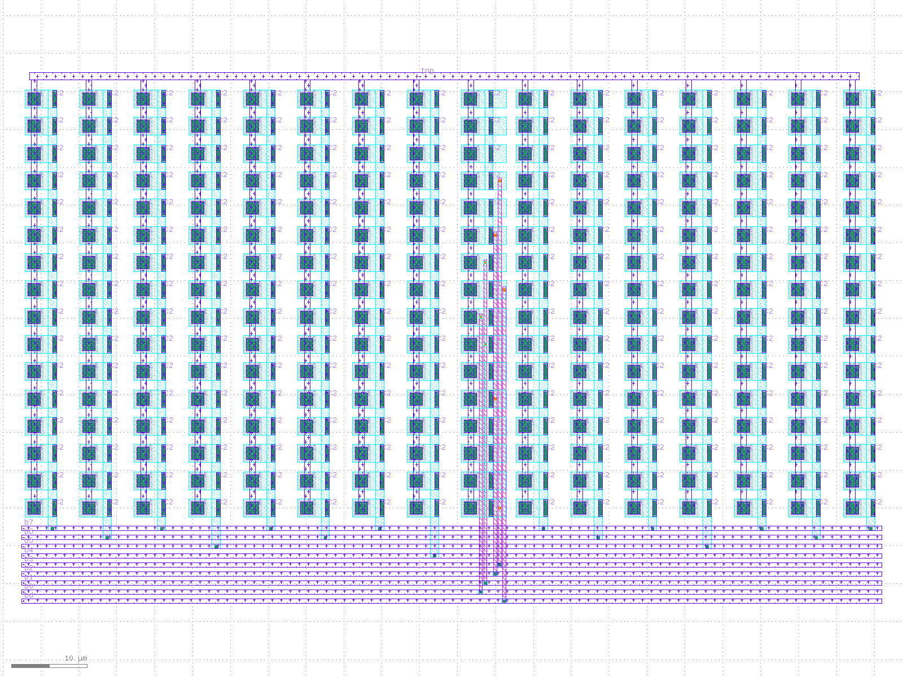
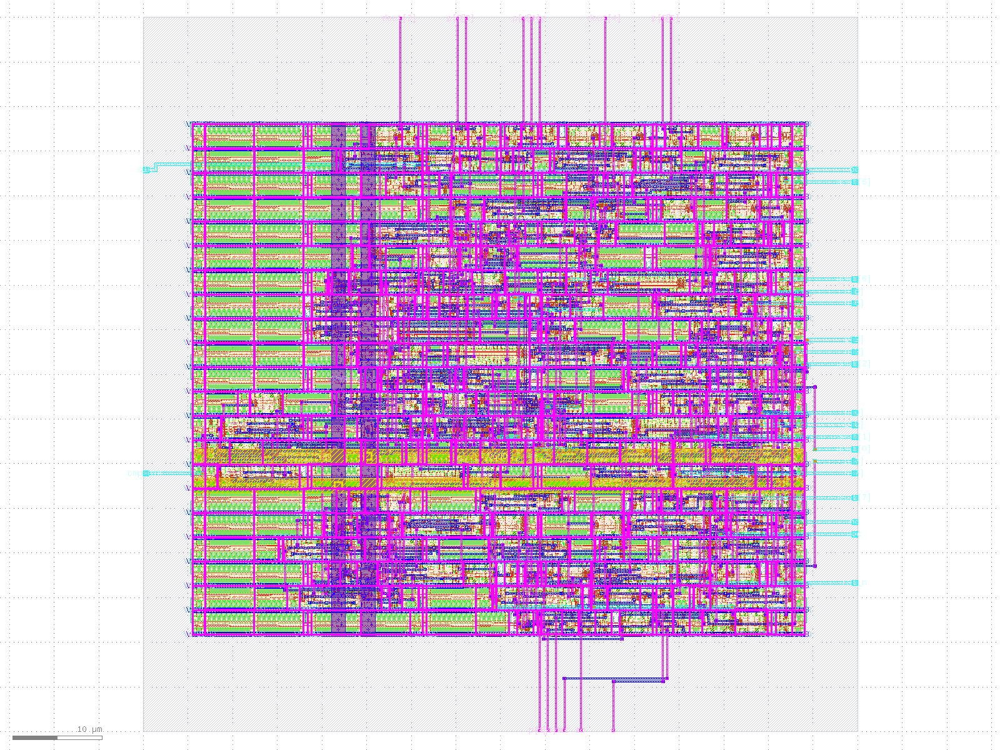

# 8-bit SAR ADC in SkyWater 130nm (open-source flow)

Full ASIC design flow for an 8-bit SAR ADC using xschem, ngspice, Magic, netgen and OpenLane on the sky130 PDK.

## Progress
- [x] CMOS inverter: schematic, simulation, layout, DRC clean, LVS clean
- [x] Comparator: design, corners, Monte Carlo offset, layout, DRC and LVS clean
- [x] Capacitor DAC: 256 MIM caps + 35 switch cells, mismatch MC, settling, layout, DRC and LVS clean
- [x] SAR logic: Verilog FSM, 2000-run test 0 errors, RTL-to-GDS with LibreLane, DRC/LVS/timing clean
- [ ] Top-level integration

## Inverter results (tt corner, 1.8 V)
| Load | tpHL | tpLH | tpd |
|---|---|---|---|
| none | 20.0 ps | 24.7 ps | 22.4 ps |
| 10 fF | 51.8 ps | 62.7 ps | 57.3 ps |
| 50 fF | 136.6 ps | 180.8 ps | 158.7 ps |

## Inverter post-layout (extracted with Magic, tt, 1.8 V)
| Load | Schematic tpd | Post-layout tpd |
|---|---|---|
| none | 22.4 ps | 26.8 ps |
| 10 fF | 57.3 ps | 55.9 ps |
| 50 fF | 158.7 ps | 144.3 ps |

## Comparator (StrongARM latch, tt, 1.8 V)
| Spec | Result |
|---|---|
| Resolution | 1 mV, all 15 corners (-40 to 125 C) |
| Offset sigma (30-run Monte Carlo) | 2.9 mV (11.8 mV before resizing input pair) |
| Delay | 0.25 - 0.53 ns |
| Power @ 100 MHz | 15.5 uW |
| Layout | Symmetric, DRC clean, LVS clean |

## Layouts (sky130, DRC and LVS clean)

### CMOS inverter

### StrongARM comparator

### 8-bit CDAC capacitor array (256 unit MIM caps, common-centroid)

## Capacitor DAC (8-bit, binary-weighted, 2x2 um MIM unit caps)
| Spec | Result |
|---|---|
| Bit weights | exact binary, 7.03 mV / LSB at 1.8 V |
| Mismatch (30-run Monte Carlo) | avg worst DNL 0.25 LSB, max 0.62 LSB, no missing codes |
| Switch settling | ~1 ns to 1/2 LSB, step error < 0.25 LSB |
| Layout | 256 caps common-centroid + 35 unit switch cells, DRC and LVS clean |

## SAR logic (Verilog, LibreLane RTL-to-GDS, sky130_fd_sc_hd)
| Spec | Result |
|---|---|
| Functional test | 2000 random conversions, 0 errors |
| Conversion | 23 cycles -> 1.09 MS/s at 25 MHz |
| Setup / hold slack @ 25 MHz | +28.2 ns / +0.12 ns |
| DRC (router, Magic, KLayout) / LVS / antenna | 0 / 0 / 0 / 0 / 0 |

